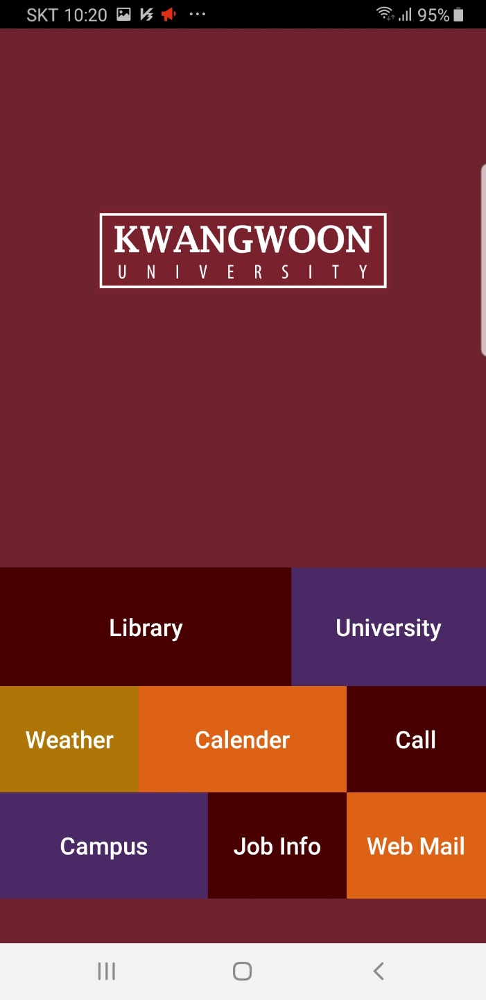
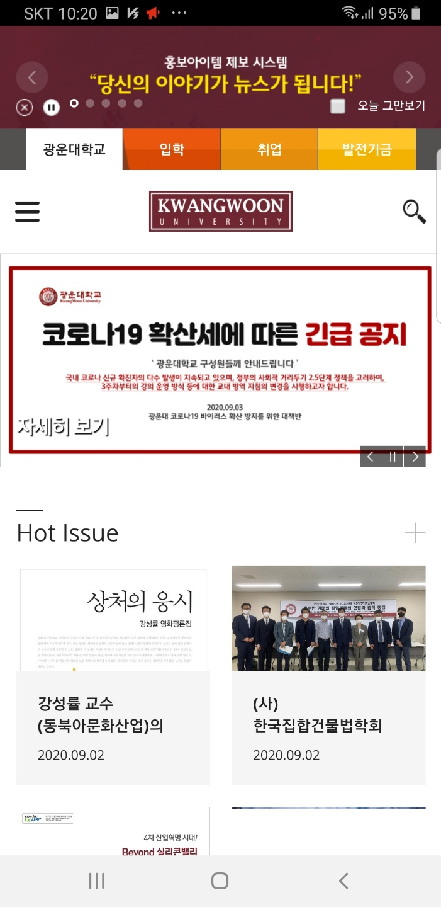
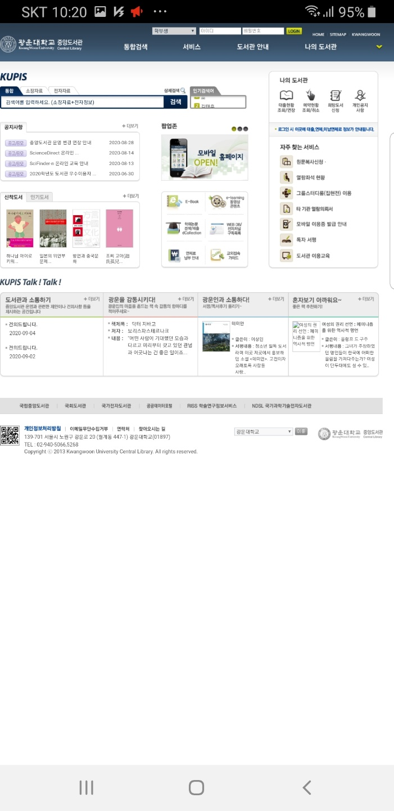
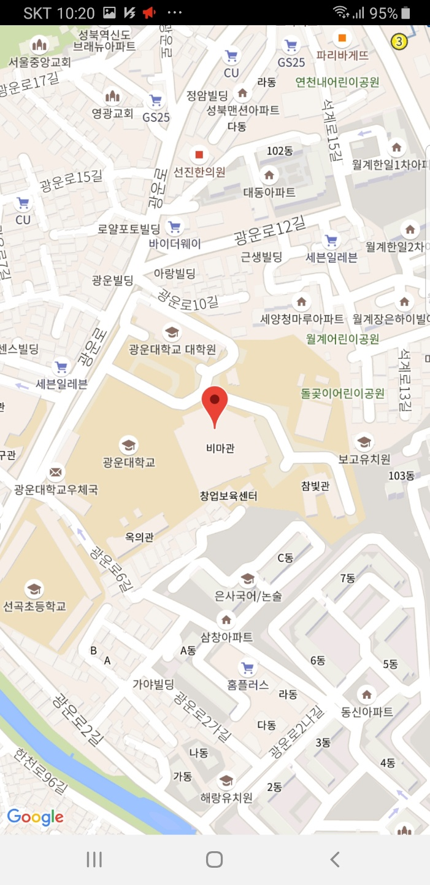
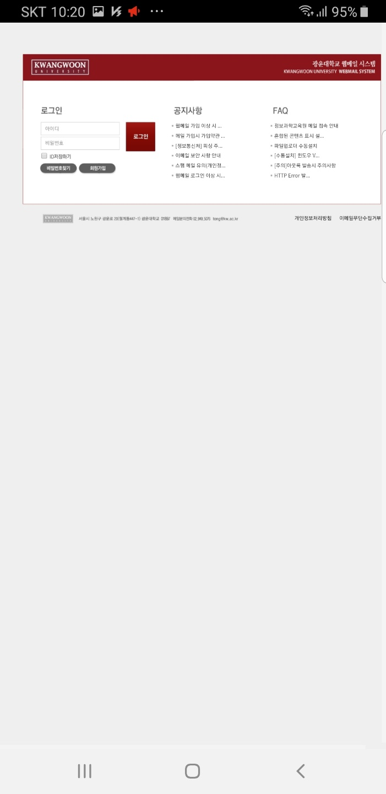
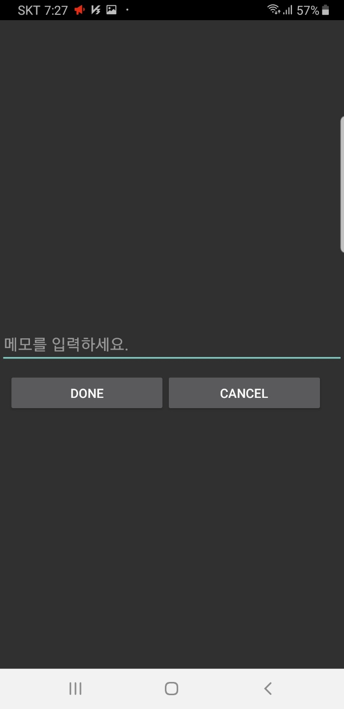
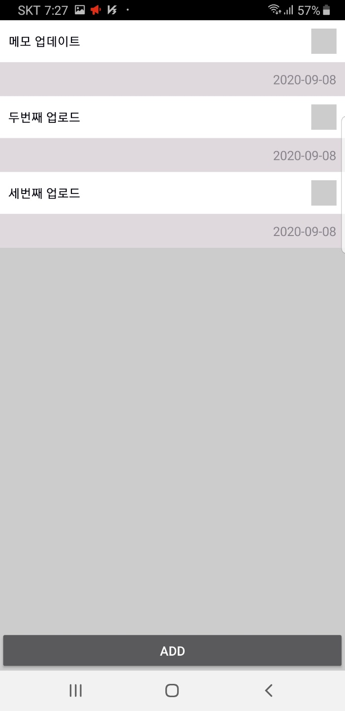
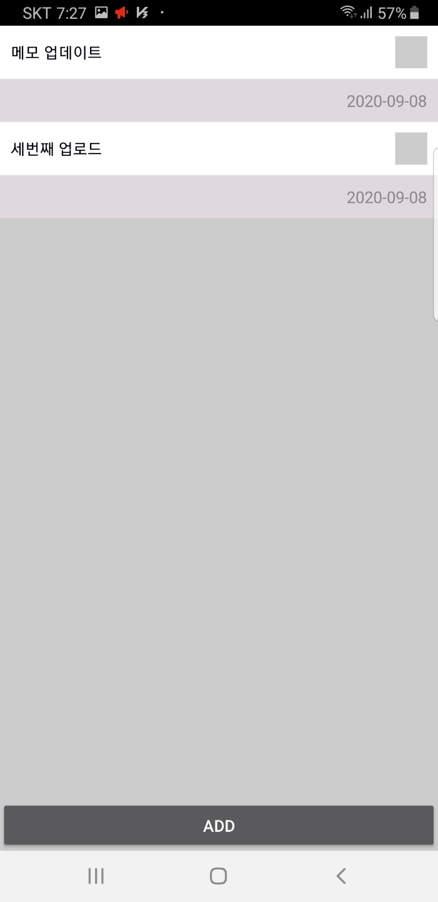

# UniversityFavorite

## Use

- Android Studio(Java)
- Google Map Open API
- Room
- RecyclerView
- DataBinding

  

> ## Abstract

- WebView를 이용한 홈페이지 연결
- Google Map을 이용한 Campus 위치
- Room Library를 이용한 Memo 기능

  

> ## 첫 화면

> ## 대학 페이지

> ## 도서관

> ## 캠퍼스

> ## 웹메일

> ## 메모장

